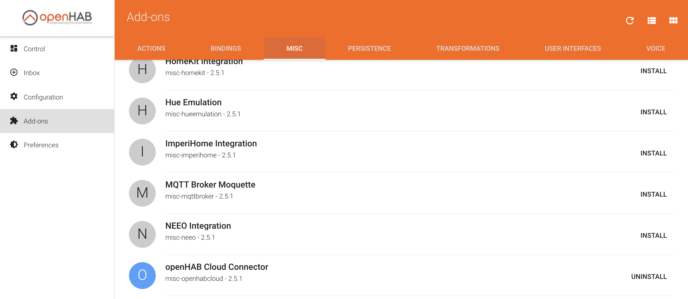
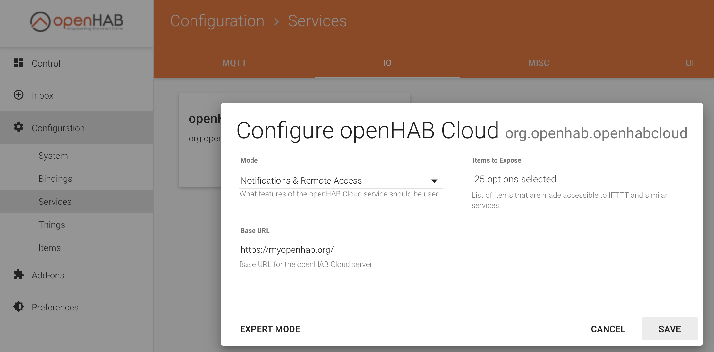
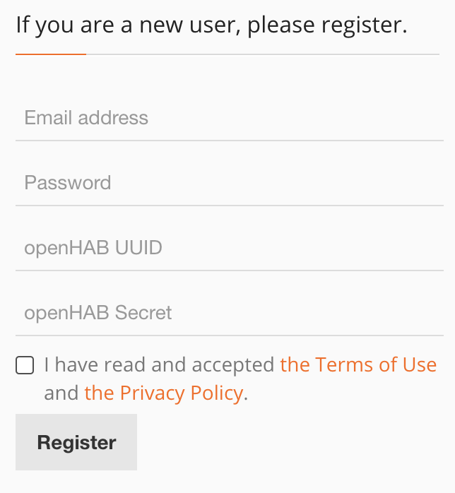

# Openhab

In order to use the openhab cloud App on your iPhone, you have to:

- enable the cloud connector add-on and configure it.
- create a user and link the uuid and secret of the RPI openhab to muopenhab on the internet.

## OpenHab Cloud Service

### Install & Configure you openhab for Cloud connection

1. http://yourRPIipAddress:8080 
2. Click on PaperUI -> Add-ons -> Misc -> Openhab Cloud Connector INSTALL

3. Configuration -> services -> IO -> openHab Cloud



To access your smartmeter via your Mobile App or Web:

1. Goto https://myopenhab.org 
2. Click on Register:

* enter your e-mail
* enter your password
* to find 'uuid' and 'secret'
```bash
# ssh into the pi
ssh pi@yourIpAddress

# execute this command and copy-paste the uuid into your Openhab Registration form
sudo nano /var/lib/openhab2/uuid

# execute this command and copy-paste the secret into your Openhab Registration form
sudo nano /var/lib/openhab2/openhabcloud/secrets
```

[See Detailed instructions on youtube:](https://www.youtube.com/watch?v=joz5f4ejJVc)


## TroubleShooting openhab

You can get realtime logs via 'karaf'

```
# from the host cli (your raspberrypi)
ssh -p 8101 openhab@192.168.32.5
# default password = habopnen

# increase the influxdb logging
log:set TRACE org.openhab.persistence.influxdb

# start logging and show latest
log:tail

#exit the cli by endig ssh
ctrl-D
```