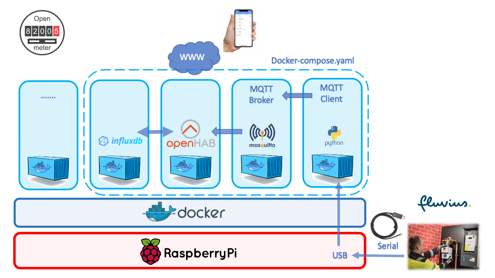
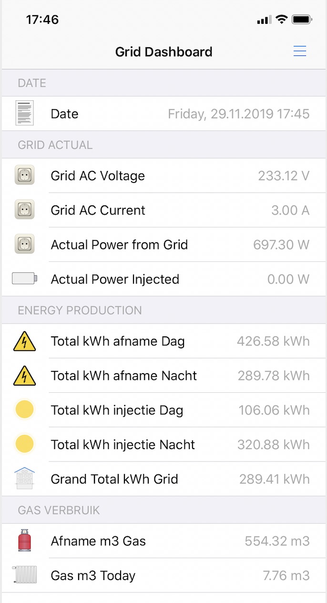

# The openmeter project

TOC:
1. What are we going to build
2. Getting Raspberrypi ready
3. How to install the openmeter solution
4. Connect it to the OpenHab Cloud App
5. Run your app
6. Extra info about:
* InfluxDB

## 1. What are we going to build



## 2. Getting Raspberrypi ready

[See repo openmeter-RPI-get-ready](https://github.com/openmeter/openmeter-RPI-get-ready)

## 3. How to install the openmeter solution

```bash
# ssh into pi
ssh pi@192.168.2.151

# goto root
cd /

#clone the repository to your pi
sudo git clone https://github.com/openmeter/openmeter.git
cd /openmeter

# run docker-compose
docker-compose up -d

```

#  4. Connect it to the OpenHab Cloud App

[openhab](OPENHAB.md)

#  5. Run it



#  6. Extra info about:
* [Influxdb](INFLUXDB.md)


